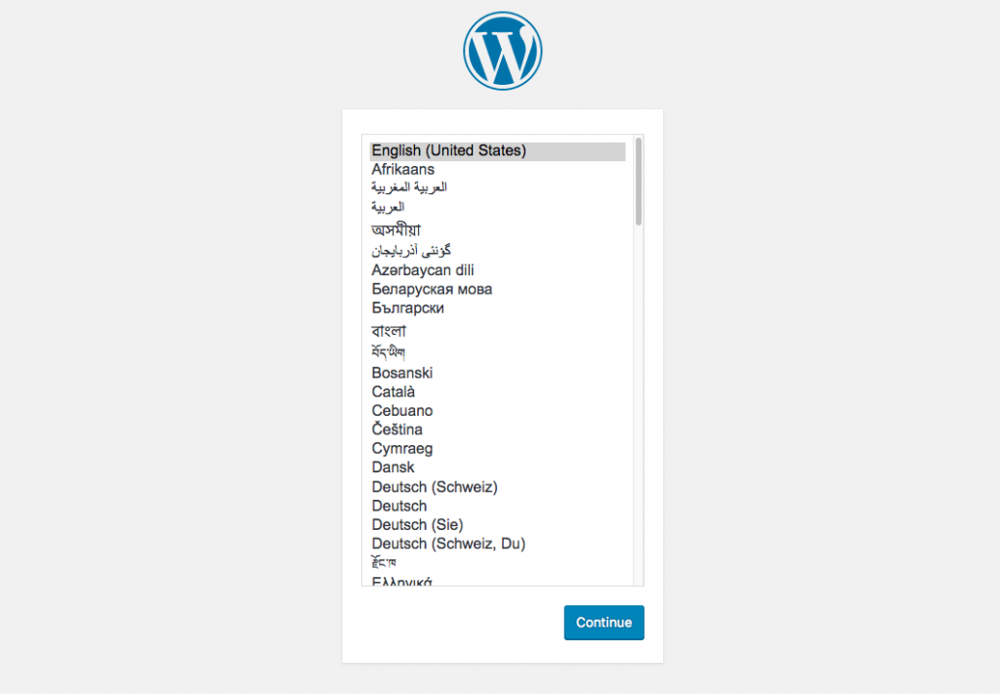

# Como Configurar o WordPress no Docker
Existem dois métodos de configurar o WordPress no Docker. O primeiro é o procedimento manual, que usa o CLI para rodar o WordPress. O segundo é o mais claro e sistemático método, que usa o Docker Compose, e que será usado como exemplo neste tutorial.

## Rodando o WordPress com o Docker Compose
Este é o método mais recomendado para criar seu container para instalar WordPress no Docker. Ele utiliza uma ferramenta própria, o Docker Compose. Cada container criado pelo Docker Compose utiliza um arquivo config, tornando mais fácil a transferência.

### Validar versão do docker
```
docker-compose --version
```

### Criar um diretório para o WordPress
```
mkdir wordpress
```

### Criar um novo arquivo de nome docker-compose.yml.

Cole o texto abaixo no arquivo .yml e salve as alterações. Isso vai iniciar um serviço de base de dados MySQL, providenciando credenciais para a base de dados e puxar a imagem para instalar WordPress do Docker Hub.
```
version: '2'

services:
   db:
     image: mysql:5.7
     volumes:
       - db_data:/var/lib/mysql
     restart: always
     environment:
       MYSQL_ROOT_PASSWORD: somewordpress
       MYSQL_DATABASE: wordpress
       MYSQL_USER: wordpress
       MYSQL_PASSWORD: wordpress

   wordpress:
     depends_on:
       - db
     image: wordpress:latest
     ports:
       - "8000:80"
     restart: always
     environment:
       WORDPRESS_DB_HOST: db:3306
       WORDPRESS_DB_USER: wordpress
       WORDPRESS_DB_PASSWORD: wordpress
volumes:
    db_data:
```
### Rodar o arquivo
```
docker-compose up -d
```
### Acessar o navegador

Agora em seu navegador entre localhost:8000 ou http://127.0.0.1:8000



admin
admin